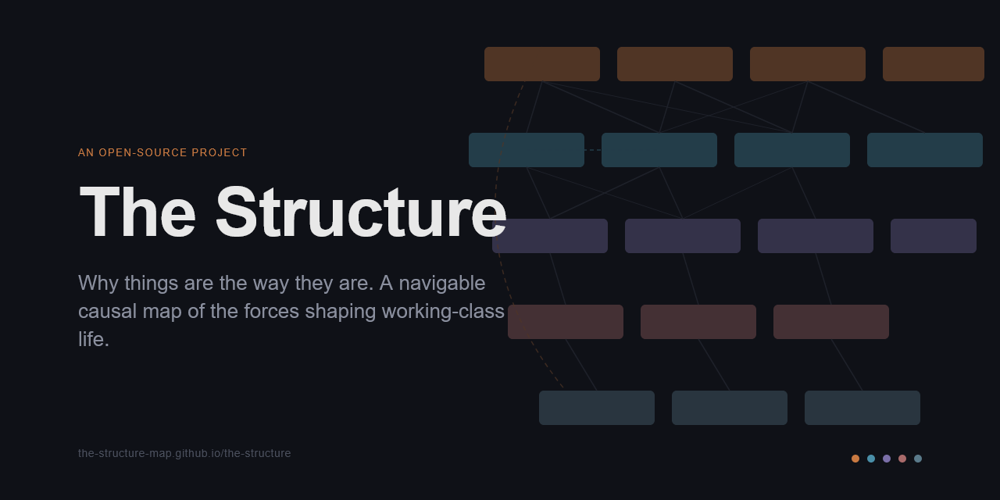

# The Structure

**Why things are the way they are.**

[Live site](https://the-structure-map.github.io/the-structure/) · [GitHub](https://github.com/the-structure-map/the-structure)

---

[](https://the-structure-map.github.io/the-structure/)

---

The Structure is an interactive map of the forces shaping working-class life in the United States. It is a directed causal graph: 34 nodes across 5 layers, from root forces (wealth concentration, financialization, regulatory capture) down through economic mechanisms, institutional collapse, social fracture, and human cost.

The goal is not to simplify the system. The goal is to make it navigable. A person can enter through their own experience — debt, job loss, isolation, political anger — and trace upstream to its structural causes. They can see who else shares those causes across lines that would normally separate them.

The map is non-partisan. It does not tell people what to do. It stops at recognition.

---

## Using it

→ **[the-structure-map.github.io/the-structure](https://the-structure-map.github.io/the-structure/)**

- Click any node to open its card
- Use **Find Your Pain** to enter through a lived experience
- Toggle between **Lived Experience** and **Analytical** language registers
- Trace edges upstream (causes) and downstream (effects)
- Feedback loops are marked with amber back-edges; click to expand their descriptions

---

## Running locally

The app is a static site — no build step, no package manager.

```bash
git clone https://github.com/the-structure-map/the-structure.git
cd the-structure
python -m http.server 8080
```

Then open `http://localhost:8080` in a browser.

A local server is required because ES modules are blocked on the `file://` protocol. Do not open `index.html` directly.

---

## How it's built

Static HTML, CSS, and JavaScript. No framework, no bundler, no dependencies beyond [Cytoscape.js](https://js.cytoscape.org/) (vendored locally) and IBM Plex Sans/Serif (served from `fonts/`). Deployable anywhere that serves static files.

```
index.html
css/
  styles.css
js/
  app.js          — entry point; initializes graph, language, interactions
  graph.js        — Cytoscape instance, layout, node/edge rendering
  interactions.js — click, hover, keyboard, path tracing
  panel.js        — node card and feedback loop panel
  sidebar.js      — Find Your Pain index and solidarity map
  toggle.js       — language register (experiential / analytical)
  markdown.js     — minimal markdown renderer for card body text
data/
  graph.json      — all map content (see below)
fonts/            — IBM Plex Sans and Serif, woff2
vendor/
  cytoscape.min.js
```

---

## The data model

All map content lives in `data/graph.json`. No content is hard-coded in the UI. Editing this file is the contribution surface for non-engineers — you can update node text, add causal relationships, or adjust the solidarity map without touching any code.

### Top-level structure

```json
{
  "meta": { ... },
  "nodes": [ ... ],
  "edges": [ ... ],
  "feedback_loops": [ ... ],
  "solidarity_map": [ ... ],
  "find_your_pain": [ ... ]
}
```

### Node fields

```json
{
  "id": "2A",
  "layer": 2,
  "layer_name": "Economic Mechanisms",
  "label_analytical": "Wage Stagnation",
  "label_experiential": "Working harder, falling further behind",
  "body_analytical": "...",
  "body_experiential": "...",
  "affected_groups": "...",
  "upstream_causes": ["1A", "1B", "1C", "1D", "1E", "3A"],
  "downstream_effects": ["2C", "2D", "2E", "2F", "4A", "4B"],
  "solidarity_connections": [],
  "amplifies": []
}
```

Each node has two language registers — `label_analytical` / `label_experiential` and `body_analytical` / `body_experiential` — switched by the toggle in the UI.

### Edge types

| Type | Description |
|---|---|
| `causal` | Standard directed cause → effect relationship |
| `feedback` | Back-edge; part of a named feedback loop |
| `solidarity` | Dashed edge connecting nodes that affect different groups sharing root causes |
| `amplifies` | Used by node 2H (Racial Wealth Gap) — intensifies effects without being a primary cause |

### Layers

| Layer | Color | Contents |
|---|---|---|
| 1 — Root Forces | `#C87941` | Wealth concentration, financialization, regulatory capture, globalization, tech disruption, climate disruption |
| 2 — Economic Mechanisms | `#4A8FA8` | Wage stagnation, job precarity, housing unaffordability, debt, healthcare costs, monopoly power, racial wealth gap |
| 3 — Institutional Collapse | `#7A6FA8` | Union decline, safety net erosion, community anchor collapse, political disenfranchisement, disappearance of third places |
| 4 — Social Fracture | `#A86A6A` | Isolation, identity crisis, gender conflict, social media acceleration, tribalism |
| 5 — Human Cost | `#5A7A8A` | Learned helplessness, mental health crisis, addiction, radicalization, collapsing social mobility |

---

## Contributing

See [CONTRIBUTING.md](CONTRIBUTING.md).

---

## License

Code (everything except `data/graph.json`) is licensed under the [MIT License](LICENSE).

Map content (`data/graph.json`) is licensed under [Creative Commons Attribution-ShareAlike 4.0 International](data/LICENSE). If you adapt the map, you must attribute the source and release your version under the same license.
